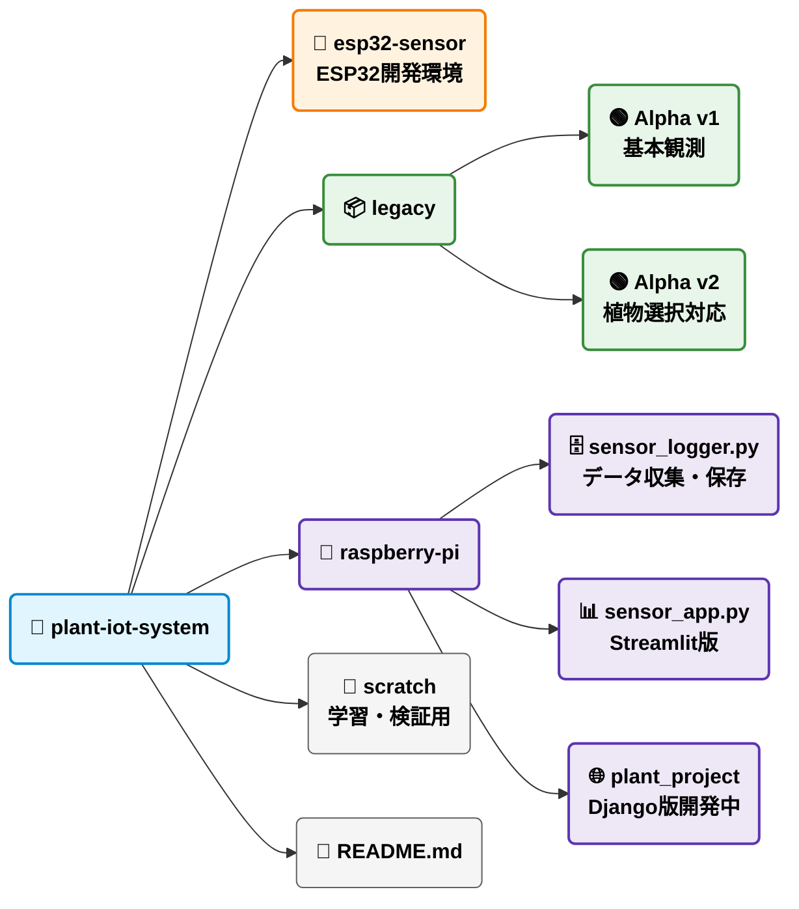
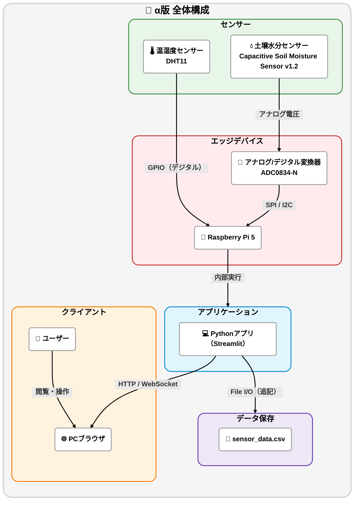
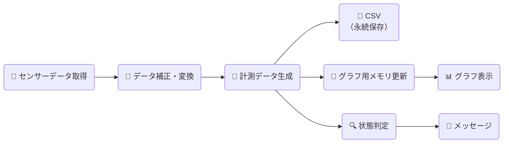

# 🪴植物環境可視化システム

**植物の状態をリアルタイムで可視化し、環境変化を判断できるIoTモニタリングシステム**

### 📚 目次

- [📚 目次](#-目次)
- [📌 概要](#-概要)
- [🎯 作成目的](#-作成目的)
- [🚀 主な機能](#-主な機能)
  - [■ データ取得](#-データ取得)
  - [■ データ処理](#-データ処理)
  - [■ データ保存](#-データ保存)
  - [■ 可視化](#-可視化)
  - [■ 状態フィードバック](#-状態フィードバック)
- [⚙️ 使用技術](#️-使用技術)
- [🔌 使用デバイス](#-使用デバイス)
- [📁 フォルダ構成と各バージョンの役割](#-フォルダ構成と各バージョンの役割)
- [🧩 システム設計](#-システム設計)
  - [1. 🟢 アルファ版](#1--アルファ版)
    - [1-1. システム構成図](#1-1-システム構成図)
    - [1-2. 処理フロー図](#1-2-処理フロー図)
- [🚧 開発状況](#-開発状況)
- [🎯 現在取り組んでいる課題](#-現在取り組んでいる課題)
- [🔮 今後の実装予定](#-今後の実装予定)
  - [β版](#β版)
  - [将来的な拡張](#将来的な拡張)
- [🌱 将来展望](#-将来展望)

***

### 📌 概要

- 植物の生育に影響する環境データ（気温・湿度・土壌水分）をセンサーで取得し、データの保存・可視化（数値・グラ  フ・メッセージ表示）を行うIoTシステム。

- ユーザーはブラウザからリアルタイムで環境状態を確認でき、植物の状態を直感的に把握することができる。

***

### 🎯 作成目的

- IoTシステム（センサー・エッジ処理・Web可視化）の一連のデータフローを実装するため

- 植物の生育と環境データの関係を定量的に観測するため

- データ可視化による意思決定支援の仕組みを構築するため

***

### 🚀 主な機能

#### ■ データ取得
- 温湿度・土壌水分センサーによるデータ取得
- Raspberry Piによる定期収集

#### ■ データ処理
- しきい値判定ロジックによる状態分類
- リアルタイムデータ処理

#### ■ データ保存
- CSV / SQLiteによる履歴管理

#### ■ 可視化
- StreamlitによるWeb表示
- matplotlibによるグラフ描画 

#### ■ 状態フィードバック
- 環境状態に応じたメッセージ表示
- UI色変化による直感的可視化

***

### ⚙️ 使用技術

- Python  
  センサーデータ取得、しきい値判定、保存処理、Web表示処理を実装

- Streamlit  
  センサーデータのリアルタイム可視化用Webアプリとして使用

- matplotlib  
  環境データのグラフ描画に使用

- SQLite / CSV  
  センサーデータの保存および履歴管理に使用

***

### 🔌 使用デバイス

- Raspberry Pi 5  
  センサーデータ取得及びシステム全体の制御用デバイスとして使用

- DHT11  
  温度・湿度データ取得用センサーとして使用
  
- ADC0834-N  
  土壌水分センサーのアナログ値をデジタル変換するために使用
  
- 静電容量式土壌水分センサー v1.2  
  植物周辺の土壌水分量測定用センサーとして使用

***

### 📁 フォルダ構成と各バージョンの役割

***

### 🧩 システム設計

#### 1. 🟢 アルファ版

##### 1-1. システム構成図

##### 1-2. 処理フロー図

※ グラフ表示にはCSVではなく、メモリ上に保持した直近20件のデータを使用する。

***

### 🚧 開発状況

- Raspberry Piセットアップ完了
- センサー（温湿度・土壌水分）によるデータ取得完了
- リアルタイムグラフ表示機能実装済み
- CSV保存機能実装済み
- しきい値判定による状態分類ロジック実装済み
- StreamlitによるWeb可視化実装済み
- SSH接続環境構築完了

***

### 🎯 現在取り組んでいる課題

- 土壌水分センサーのキャリブレーション精度向上
- 紙コップによる小規模検証から実際の栽培環境への検証拡大
- 過去データの閲覧・分析機能の実装
- DHT22への移行を含めたセンサー精度向上の検討
- ESP32を活用した複数植物の同時観測システムの構築
- Djangoへの移行によるシステム拡張性の向上

現在は基本的な観測・保存・可視化機能が完成しており、実運用を見据えた精度向上とシステム拡張に取り組んでいる。

***

### 🔮 今後の実装予定

#### β版

- Django版Webアプリの開発
- SQLiteを活用したデータ管理基盤の整備
- ESP32による無線センサーノード化
- 複数植物の同時観測機能
- 過去データの閲覧・分析機能
- センサー精度向上およびしきい値最適化

#### 将来的な拡張

- UI/UX改善
- 長期データのトレンド分析
- 異常検知アラート機能
- 植物ごとの生育アドバイス機能
- スマートフォン向け画面最適化
- 複数デバイス管理機能

***

### 🌱 将来展望

本システムは単なる環境モニタリングシステムではなく、植物栽培を支援するIoTプラットフォームへの発展を目指している。

将来的には以下の機能実装に挑戦したい。

- 温度・湿度・土壌水分を総合的に評価する植物状態スコア機能
- AIを活用した栽培アドバイス機能
- クラウドを利用した遠隔監視・データ共有機能
- 長期間の環境データを活用した生育傾向分析
- 農業・家庭菜園向けサービスへの発展