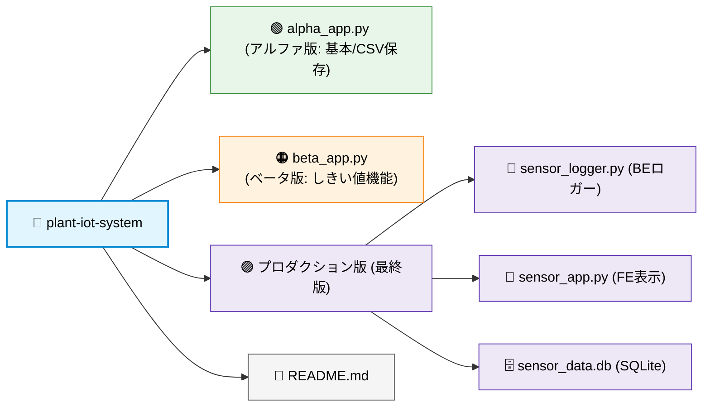
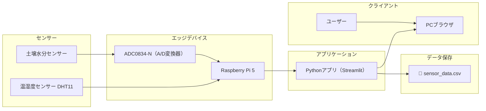

# 🪴植物環境可視化システム

### 植物の状態をリアルタイムで可視化し、環境変化を判断できるIoTモニタリングシステム

### 📌 概要

- 植物の生育に影響する環境データ（気温・湿度・土壌水分）をセンサーで取得し、データの保存・可視化（数値・グラ  フ・メッセージ表示）を行うIoTシステム。

- ユーザーはブラウザからリアルタイムで環境状態を確認でき、植物の状態を直感的に把握することができる。

***

### 🎯 作成目的

- IoTシステム（センサー・エッジ処理・Web可視化）の一連のデータフローを実装するため

- 植物の生育と環境データの関係を定量的に観測するため

- データ可視化による意思決定支援の仕組みを構築するため

***

### 🚀 主な機能

#### ■ データ取得
- 温湿度・土壌水分センサーによるデータ取得
- Raspberry Piによる定期収集

#### ■ データ処理
- しきい値判定ロジックによる状態分類
- リアルタイムデータ処理

#### ■ データ保存
- CSV / SQLiteによる履歴管理

#### ■ 可視化
- StreamlitによるWeb表示
- matplotlibによるグラフ描画 

#### ■ 状態フィードバック
- 環境状態に応じたメッセージ表示
- UI色変化による直感的可視化

***

### ⚙️ 使用技術

- Python  
  センサーデータ取得、しきい値判定、保存処理、Web表示処理を実装

- Streamlit  
  センサーデータのリアルタイム可視化用Webアプリとして使用

- matplotlib  
  環境データのグラフ描画に使用

- SQLite / CSV  
  センサーデータの保存および履歴管理に使用

***

### 🔌 使用デバイス

- Raspberry Pi 5  
  センサーデータ取得及びシステム全体の制御用デバイスとして使用

- DHT11  
  温度・湿度データ取得用センサーとして使用
  
- ADC0834-N  
  土壌水分センサーのアナログ値をデジタル変換するために使用
  
- 静電容量式土壌水分センサー v1.2  
  植物周辺の土壌水分量測定用センサーとして使用

***

### 📁 フォルダ構成と各バージョンの役割



***

### 🧩 システム設計

#### 1. 🟢 アルファ版

##### 1-1. システム構成図



##### 1-2. 処理フロー図

```mermaid
graph LR
    センサーデータ取得 --> データ整形
    データ整形 --> しきい値判定
    --
```


***

### 🚧 開発状況

- Raspberry Piセットアップ完了
- センサー（温湿度・土壌水分）によるデータ取得完了
- リアルタイムグラフ表示機能実装済み
- CSV保存機能実装済み
- しきい値判定による状態分類ロジック実装済み
- StreamlitによるWeb可視化実装済み
- SSH接続環境構築完了

***

### 🔮 今後の実装予定

- SQLiteによる永続データ管理への移行
- UI改善（視認性・色設計の最適化）
- データ履歴の長期トレンド分析機能
- 異常検知アラート機能の追加
